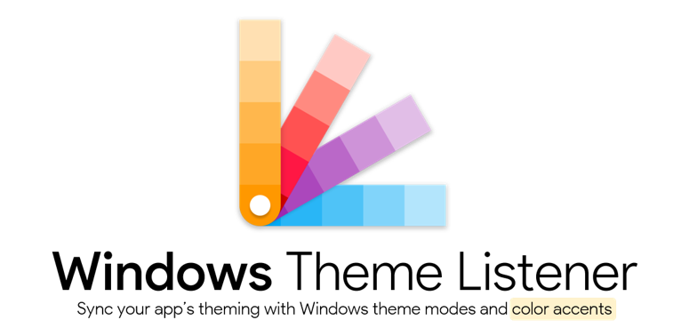
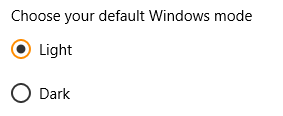
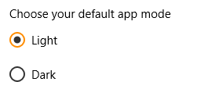
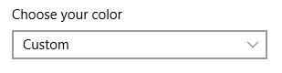
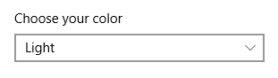
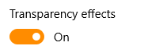
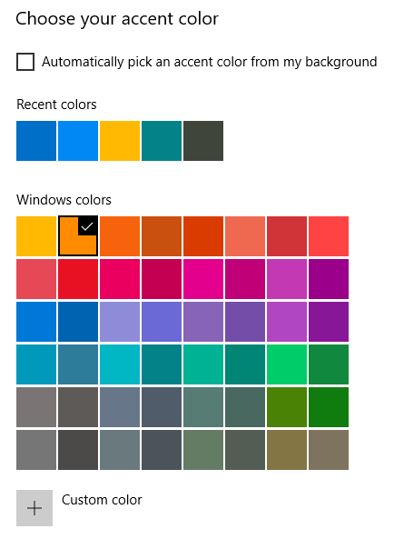

# WindowsThemeListener
[](https://www.nuget.org/packages/WindowsThemeListener/) [](https://www.buymeacoffee.com/willykimura)

**WindowsThemeListener (WTL)** is a library that listens to any modern Windows OS's theming and color settings. With this nifty library, your .NET applications can now automagically employ the current Windows theme mode and accent colors applied across all modern Windows Operating Systems.

<div align="center">




</div>

# Installation 

To install via the [NuGet Package Manager](https://www.nuget.org/packages/WindowsThemeListener/) Console, run:

> `Install-Package WindowsThemeListener`

# Features
- Supports [.NET Framework 4.0](https://www.microsoft.com/en-us/download/details.aspx?id=17718), [.NET Core 3.1](https://dotnet.microsoft.com/download/dotnet-core/3.1) and [.NET 5.0](https://dotnet.microsoft.com/download/dotnet/5.0).
- Silently monitors Windows personalization settings in the background.
- Listens to the default Windows Mode and App Mode theming options.
- Listens to the Windows primary accent color changes.
- Supports accent forecolor generation based on accent color changes.
- Supports enabling/disabling theme monitoring at runtime.
- Super easy API for integrating with .NET applications.

# Usage
To begin with, once you've installed the library, ensure you import the namespace `WK.Libraries.WTL`:

```c#
using WK.Libraries.WTL;
```

Windows Theme Listener is a static library so no there's need for instantiation:

```c#
ThemeListener.Enabled = true;
ThemeListener.ThemeOptionsChanged += OnThemeOptionsChanged;

private void OnThemeOptionsChanged(object sender, ThemeListener.ThemeOptionsChangedEventArgs e)
{
    // You can query for the following options:
    // ----------------------------------------
    // e.WindowsMode
    // e.AppMode
    // e.TransparencyEnabled
    // e.AccentColor
    // e.AccentForeColor
    
    // For example...
    if (e.AppMode == ThemeModes.Light) 
    {
        // Switch app to light mode.
    }
    else if (e.AppMode == ThemeModes.Dark) 
    {
        // Switch app to dark mode.
    }
}
```

If you would like to know which theme options were changed, use the `OptionsChanged` list event argument:

```c#
private void OnThemeOptionsChanged(object sender, ThemeListener.ThemeOptionsChangedEventArgs e)
{
    if (e.OptionsChanged.Contains(ThemeListener.ThemeOptions.WindowsMode))
        // The Windows Theme Mode was changed.

    if (e.OptionsChanged.Contains(ThemeListener.ThemeOptions.AppMode))
        // The App Theme Mode was changed.
}
```

As seen, the `OptionsChanged` property is of a list type, defined as: `List<ThemeOptions>`. The `ThemeOptions` is an enumeration that exposes all supported theming options in the library.

You can also access the theming options manually using the related properties:

```c#
var appMode = ThemeListener.AppMode;                    // Get the App theme mode setting.
var winMode = ThemeListener.WindowsMode;                // Get the Windows theme mode setting.
bool transparent = ThemeListener.TransparencyEnabled;   // Get the Windows transparency setting.
Color accentColor = ThemeListener.AccentColor;          // Get the Windows accent color setting.
Color accentForeColor = ThemeListener.AccentForeColor;  // Get the accent forecolor setting (generated).
```

The `AccentForeColor` is an internally generated color that is based on the accent color applied. This generally means that whenever the accent color changes, a contrasting foreground color that blends well with the accent color background is generated and provided.

You can also generate a custom accent forecolor using the method `GenerateAccentForeColor([Color accentColor])`:

```c#
// Get a custom accent forecolor.
Color foreColor = ThemeListener.GenerateAccentForeColor(Color.Khaki);
```

To enable or disable listening to setting changes, simply set the property `Enabled` to `true` or `false` respectively:

```c#
// Disable listening to setting changes.
ThemeListener.Enabled = false;
```

However, you can still access the theme settings directly using their respective properties:

```c#
var appMode = ThemeListener.AppMode;
var winMode = ThemeListener.WindowsMode;
```

To change the interval with which Windows Theme Listener uses to poll for changes made to the theme settings, use the `Interval` property:

```c#
// Set a custom interval for checking setting changes (unit in milliseconds).
ThemeListener.Interval = 20000; // 20000 = 20secs.
```

## Windows Theming Explainer

By default, Windows uses the term **modes** or better yet themes which can be set at either the application level or the system level.

*Let's see what each option does:*

- The `WindowsMode` references the **Windows mode** theme option and is applied across all Windows applications:

  

- The `AppMode` option references the **App mode** theme option which specifically targets [UWP Applications](https://docs.microsoft.com/en-us/windows/uwp/get-started/universal-application-platform-guide), e.g. Skype:

  

> ***Note:***
>
> The above two options, namely the `WindowsMode` and `AppMode` are only available once a user sets the default color to **Custom**:
>
> 
>
> However, choosing either `Light` or `Dark` will set the default theme for both the `AppMode` and  the `WindowsMode` options:
>
> 

- The `TransparencyEnabled` option targets applications that support Windows' transparency feature, e.g. [UWP Apps](https://docs.microsoft.com/en-us/windows/uwp/get-started/universal-application-platform-guide). Likewise if your .NET application supports transparency of some degree, feel free to reference this setting:

  

- The `AccentColor` references the Windows accent color applied:

  

As noted before, the `AccentForeColor` is an internally generated color that is based on the accent color applied.

## Targeting Windows versions

WTL also comes packaged with a helper class, `OS`, that lets you check the Windows version it's being run on. This is because Windows 7 and lower do not support the available theming options provided in Windows 8 and higher.

To check the Windows version being run, use the property `OS.Version` or `OS.MajorVersion`:

```c#
int ver = OS.Version;
// Returns: 10 for Windows 10, 8 for Windows 8, 7 for Windows 7...
```

You can also choose to inform your users and/or disable theming whenever your app is running on Windows 7 and lower:

```c#
if (OS.Version >= 8) // If Windows 8 and higher...
{
    // Your code here.
}
```

# Donate

If you like my projects and would love to support me, consider donating via [BuyMeACoffee](https://www.buymeacoffee.com/willykimura). All donations are optional and are greatly appreciated. 🙏

*Made with* 💛 *by* [*Willy Kimura*]([https://github.com/Willy-Kimura)